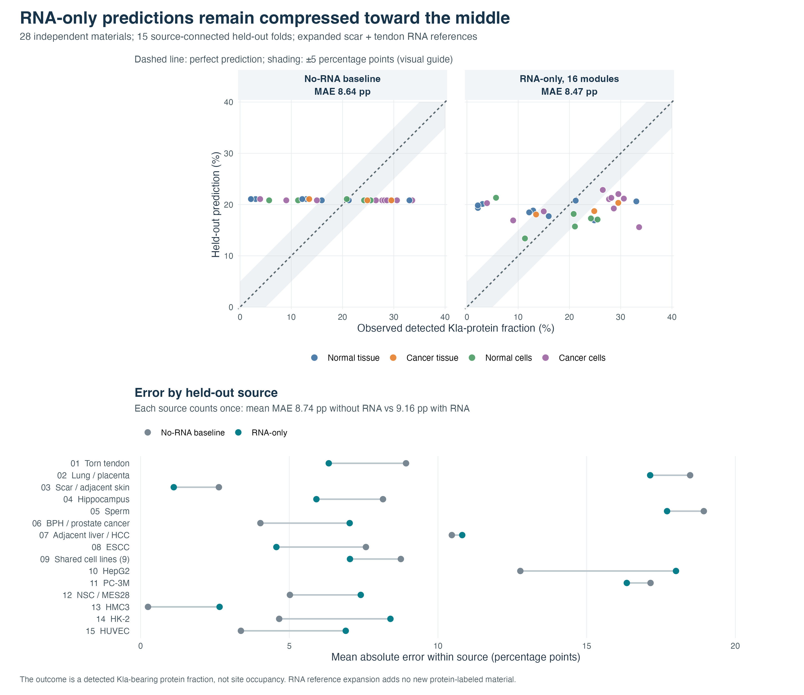
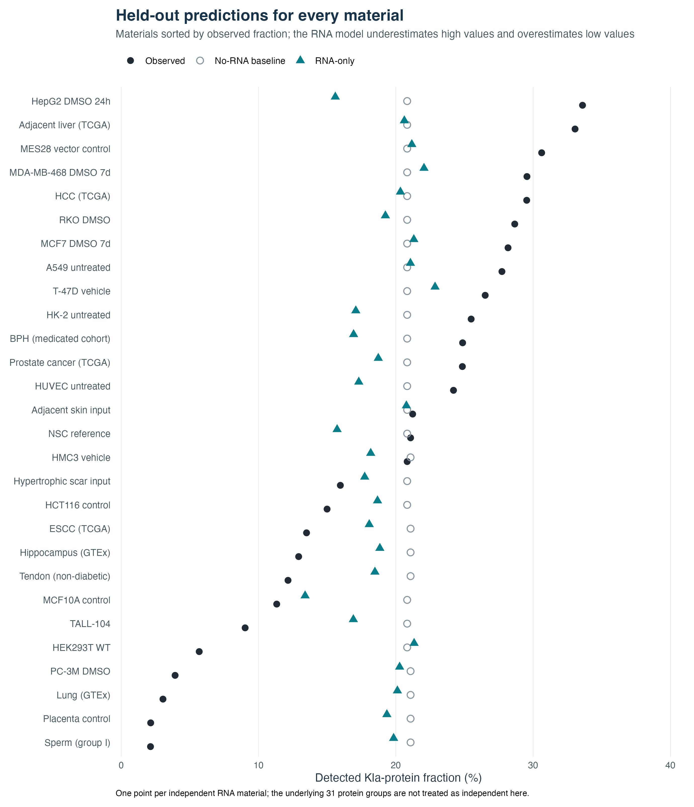

# RNA-only model capability figures

Generated by `workflow/rna_expansion/plot_rna_only_model_capability.R` from the
frozen combined scar-and-tendon RNA reference scenario. Both figures use only
out-of-fold predictions: each material is predicted while its entire
source-connected group is held out. The 31 underlying protein groups contribute
28 independent RNA materials in 15 held-out components. The protein-derived
target is the percentage of detected Kla-bearing proteins among detected
reference-proteome proteins, not biochemical Kla-site occupancy.

## Main figure

The upper panels compare observed versus held-out predicted fractions for the
source-balanced no-RNA median and the fixed 16-module RNA ridge model. The
diagonal marks exact prediction; the shaded ±5 percentage-point region is a
visual guide, not a test threshold. The lower panel shows mean absolute error
for each of the 15 held-out source components, giving a source with one material
the same visual weight as a source with nine materials.

The observed range is 2.13–33.59%, whereas RNA predictions occupy only
13.39–22.86%, revealing strong compression toward the center. Material-level
MAE is 8.47 percentage points for RNA versus 8.64 for the no-RNA baseline.
Source-macro MAE is 9.16 versus 8.74, respectively. Seven of 28 RNA
predictions and eight of 28 baseline predictions fall within the visual
±5-point guide. The figure therefore supports an assessment of limited
predictive ability, not an improvement claim.

## Material-level companion

Each row is one independent material, sorted by its observed fraction. Solid
black dots are observations, open gray circles are no-RNA predictions, and
teal triangles are RNA predictions. The full table of material values is
`outputs/20260924_rna_only_model_figures/figure_material_data.csv`.

Both figures are also saved as vector PDFs in that output directory. They are
an exploratory visualization of the existing held-out comparison; the expanded
RNA references supplied no additional paired protein outcome labels.
