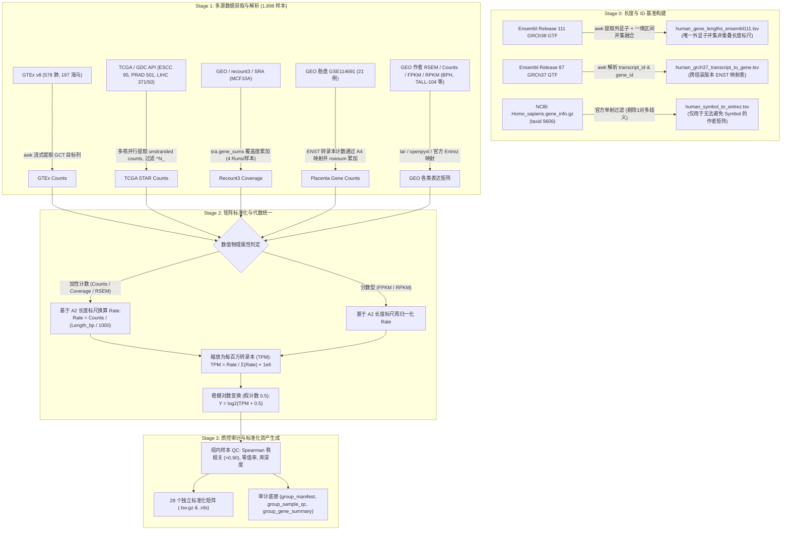

# 31 组 Kla ∩ DDR 转录组（RNA-seq）数据处理与分析全流程规范

**文档版本**：V1.1 (2026-09-17)  
**分析范围**：31 类生物学材料（9 非肿瘤组织、3 肿瘤组织、12 癌细胞系、7 正常细胞/模型），涵盖 28 个独立参考矩阵，共计 1,898 个高质量生物学测序样本  
**主要脚本体系**：
- **Stage 0 注释标尺与映射表构建**：
  - 外显子并集长度标尺：[`workflow/server_prepare_gene_annotation_20260916.sh`](../workflow/server_prepare_gene_annotation_20260916.sh)
  - 跨组装转录本映射：[`workflow/server_prepare_grch37_transcript_map_20260916.sh`](../workflow/server_prepare_grch37_transcript_map_20260916.sh)
- **Stage 1 原始数据获取与路由**：
  - DepMap 24Q4 基线获取与校验：[`workflow/server_download_depmap_20260914.R`](../workflow/server_download_depmap_20260914.R)、[`workflow/validate_depmap_expression_20260914.py`](../workflow/validate_depmap_expression_20260914.py)
  - TCGA GDC STAR Counts 获取：[`workflow/build_gdc_star_counts_manifest_20260914.R`](../workflow/build_gdc_star_counts_manifest_20260914.R)、[`workflow/server_download_gdc_star_counts_20260914.R`](../workflow/server_download_gdc_star_counts_20260914.R)
- **Stage 2 & 3 多源矩阵标准化提取与汇总**：
  - 核心提取与标准化库：[`workflow/lib_kla31_expression_20260916.R`](../workflow/lib_kla31_expression_20260916.R)
  - 31 组多源矩阵流式提取：[`workflow/build_31_expression_matrices_20260916.R`](../workflow/build_31_expression_matrices_20260916.R)
  - 审计底册与元数据汇总：[`workflow/finalize_31_expression_matrices_20260916.R`](../workflow/finalize_31_expression_matrices_20260916.R)
- **Stage 4 跨组织组织感知归一化**：
  - 平滑分位数归一化：[`workflow/qsmooth_31group_20260916.R`](../workflow/qsmooth_31group_20260916.R)
- **Stage 5 DDR 映射与覆盖**：
  - 双向映射与通路覆盖：[`workflow/map_ddr_uniprot_to_ensembl_20260916.py`](../workflow/map_ddr_uniprot_to_ensembl_20260916.py)、[`workflow/overlay_ddr_panel_20260916.py`](../workflow/overlay_ddr_panel_20260916.py)
- **Stage 6 & 7 辅助生物学解析与出版级可视化**：
  - 转录组辅助生物学解析：[`workflow/explore_rna_assisted_ddr_20260917.R`](../workflow/explore_rna_assisted_ddr_20260917.R)
  - 出版级可视化：[`workflow/plot_rna_reference_31group_20260917.R`](../workflow/plot_rna_reference_31group_20260917.R)

---

## 1. 背景与核心设计原则

### 1.1 为什么需要在 Kla 蛋白质组中引入转录组？
蛋白质质谱分析（LC-MS/MS）基于随机抽样及检测动态范围的物理限制，修饰蛋白质组（Lactylome）仅提供"检出/未检出"状态。

本项目的蛋白质组数据**已有配对的未富集全蛋白参照组（Ref）**。因此对每个（材料 × 蛋白）组合可以得到 2×2 的检出状态，其中"**蛋白在全蛋白组检出、但不在乳酰化组（Kla−/Ref+）**"这类组合，**仅凭蛋白质组自身即可判定**，不需要转录组。

转录组能补充的只有一种情形：**两套质谱均未检出（Kla−/Ref−）**。此时无法从蛋白质组判断该蛋白是"确实不存在"还是"存在但两套方法都没捕获"。引入全转录组（RNA-seq）作为连续表达基准，用于区分这两种来源。

> 需要说明的是：本项目蛋白质组数据的核心指标是**检出集合的比值**（`KlaDdrFraction` 及与参照组的差值），并非蛋白丰度。转录组在本流程中定位于**解释检出缺失的来源**，不与蛋白丰度做定量比较。

### 1.2 核心分析约束与生信规范
- **严禁使用 Gene Symbol 进行分析**：Gene Symbol 存在别名混淆、版本退役和命名漂移风险；全流程以不可变的 **Ensembl Gene ID**（`ENSG...`，GRCh38 / Ensembl v111）和 UniProt **BaseAccession** 为唯一主键，Symbol 仅用于最终展示。
- **固定随机种子**：涉及所有随机化、抖动采样及数值计算，严格固定随机种子为 `25`（项目统一标识）。
- **材料类别参考谱属性（Reference Profile）**：31 组 RNA-seq 数据来自公开发表的权威高质量队列（GEO 18 组、GTEx v8 2 组、TCGA/GDC 4 组、recount3 1 组），与项目中的 Kla 质谱样品为**材料类别级匹配**，而非同受试者严格配对。因此，所有跨组学比较均在类别尺度（Material Class）进行，绝不伪造配对检验。
- **版本控制与目录隔离**：脚本受 Git 严密追踪；代码与输出目录完全隔离，避免历史错误数据污染。

---

## 2. 31 组材料来源与 28 个参考矩阵全景架构

31 组生物材料涵盖人类主要组织与细胞模型，划分为四大生物学类别。其中，三个 HCT116 组（KLA31_14/15/16）以及两个 HK-2 组（KLA31_27/28）分别共享同一份高质量转录组基线，因此全套材料由 **28 个独立参考矩阵**（包含 1,898 个独立样本）严格映射生成。

```
31 组材料结构
├── 非肿瘤组织 (Non-tumor tissues, n=9)
│   ├── KLA31_01: 肩袖病理性撕裂肌腱 (GSE236746)
│   ├── KLA31_02: 正常人肺组织 (GTEx v8)
│   ├── KLA31_03: 增生性瘢痕组织 (GSE181540)
│   ├── KLA31_04: 瘢痕邻近未受损皮肤 (GSE181540)
│   ├── KLA31_05: 人海马脑区 (GTEx v8)
│   ├── KLA31_06: 正常妊娠胎盘 (GSE114691；GEO 无孕周字段，未做足月筛选)
│   ├── KLA31_07: 人精子 (GSE65683)
│   ├── KLA31_08: 良性前列腺增生 BPH (GSE132714)
│   └── KLA31_09: 癌旁正常肝组织 (TCGA-LIHC Solid Tissue Normal)
├── 肿瘤组织 (Tumor tissues, n=3)
│   ├── KLA31_10: 食管鳞状细胞癌 ESCC (TCGA-ESCA 确诊鳞癌，排除腺癌)
│   ├── KLA31_11: 前列腺癌 (TCGA-PRAD 原发肿瘤)
│   └── KLA31_12: 肝细胞癌 HCC (TCGA-LIHC 原发肿瘤)
├── 癌细胞系 (Cancer cell lines, n=12)
│   ├── KLA31_13: MCF7 (GSE157383 / DepMap ACH-000019)
│   ├── KLA31_14/15/16: HCT116 共享基线 (GSE253699 / DepMap ACH-000971)
│   ├── KLA31_17: TALL-104 (GSE163787，Plan A 严格 bulk 库)
│   ├── KLA31_18: HepG2 亲本基线 (GSE158552 / DepMap ACH-000739)
│   ├── KLA31_19: A549 (GSE171750 / DepMap ACH-000681)
│   ├── KLA31_20: MDA-MB-468 (GSE157383 / DepMap ACH-000849)
│   ├── KLA31_21: T-47D (GSE283812 / DepMap ACH-000147)
│   ├── KLA31_22: PC-3M 细胞对照 (GSE235595)
│   ├── KLA31_23: 胶质母细胞瘤干细胞 MES28 载体对照 (GSE266884)
│   └── KLA31_24: RKO 亲本基线 (GSE318640 / DepMap ACH-000943)
└── 正常细胞系与培养模型 (Normal cell lines/models, n=7)
    ├── KLA31_25: HEK293T 未处理野生型 (GSE203529)
    ├── KLA31_26: HMC3 溶剂对照 (GSE275256)
    ├── KLA31_27/28: HK-2 共享未处理对照 (GSE240748)
    ├── KLA31_29: MCF10A 对照 (GSE103520 / recount3)
    ├── KLA31_30: 神经干细胞 NSC 对照模型 (GSE119834)
    └── KLA31_31: HUVEC 全细胞基线 (GSE203551 / ENCODE)
```

> [!IMPORTANT]
> **关于括号中的 `DepMap ACH-*`**：这是**蛋白组侧**用于锁定细胞系身份的模型编号，**不是 RNA 来源**；本流程的 RNA 全部来自 GSE / GTEx / TCGA / recount3。
>
> **共享参照显式追踪**：  
> 三个 HCT116 组（KLA31_14/15/16）以及两个 HK-2 组（KLA31_27/28）分别共享同一份转录组基线，因此实际包含 **28 个独立参考矩阵**。在下游归一化及膨胀至 31 组时，通过 [`outputs/20260916_qsmooth_31group/group_expansion_31.csv`](../outputs/20260916_qsmooth_31group/group_expansion_31.csv) 显式记录 `ReferenceKey`，杜绝重复计算伪自由度。

---

## 3. 上游数据获取、注释标尺构建与矩阵标准化处理 (Upstream Processing)

本章节系统阐述从公开发表的原始数据检索、服务器端流式提取、外显子并集基因长度构建、跨版本转录本映射、到表达量代数换算与组内质量控制（QC）的完整上游技术细节。



### 3.1 原始多源数据检索、获取与路由策略

针对 31 类生物学材料对应的 28 个参考组，项目建立了严格的分类接入路由协议（`handlers` 调度架构，见 [`workflow/build_31_expression_matrices_20260916.R`](../workflow/build_31_expression_matrices_20260916.R)）：

| 数据来源与接入 Handler | 代表性材料组 | 样本数 (n) | 原始数据形态 | 提取与处理技术细节 |
|---|---|---|---|---|
| **GTEx v8** (`h_gtex_v8`) | KLA31_02 (正常肺)<br>KLA31_05 (海马脑区) | 肺: 578<br>海马: 197 | `GTEx_Analysis_2017-06-05_v8_RNASeQCv1.1.9_gene_reads.gct.gz` (1.2 GB) | 1. 读取样本属性表 `SampleAttributesDS.txt`，依 `SMTSD` 提取目标组织条目；<br>2. 剔除仅有属性登记但该 release 无测序行的子切片（海马剔除 46 个，肺剔除 289 个）；<br>3. 动态生成 `awk` 流式过滤脚本，单遍流式读取 GCT，提取目标列，避免耗尽宿主机内存。 |
| **TCGA / GDC API** (`h_gdc_star`) | KLA31_09 (癌旁正常肝)<br>KLA31_10 (食管鳞癌 ESCC)<br>KLA31_11 (前列腺癌 PRAD)<br>KLA31_12 (肝细胞癌 HCC) | 正常肝: 50<br>ESCC: 95<br>PRAD: 501<br>HCC: 371 | GDC augmented STAR gene counts (GENCODE v36, TSV per sample) | 1. 严格锁定组织学分类：TCGA-ESCA 中仅提取病理确诊的 **ESCC（鳞状细胞癌）**，坚决剔除腺癌（Adenocarcinoma），保证材料真实对齐；<br>2. 排除 `Solid Tissue Normal` 以外的重复 aliquot；<br>3. 使用 `mclapply` 多核并行读取单样本 TSV，利用 `colClasses` 跳过冗余列仅加载 `unstranded` 计数；<br>4. 过滤 `^N_` 质控行（`N_unmapped`, `N_multimapping`, `N_noFeature`, `N_ambiguous`）。 |
| **recount3 / SRA** (`h_recount3_runs`) | KLA31_29 (MCF10A 对照) | 3 | `sra.gene_sums.SRP117021.G026.gz` | 1. 跳过开头的 `##annotation=` 元数据注释头；<br>2. recount3 的 `sra.gene_sums` 记录的是单碱基覆盖度总和（base-level coverage sums），每个样本包含 4 条独立的测序 Run（SRR），在样本内对 Runs 进行精确行累加。 |
| **GEO 跨版本转录本计数** (`h_transcript_counts`) | KLA31_06 (正常胎盘) | 21 | `GSE114691_MasterCount_ControlONLY.txt.gz` | 原作者基于 GRCh37 的转录本定量（ENST）。调用 Ensembl GRCh37.87 转录本映射表汇聚为 ENSG（详见 3.3 节）。 |
| **GEO / NCBI 稳定 Counts** (`h_ncbi_counts`) | KLA31_01 (肌腱)<br>KLA31_07 (精子)<br>KLA31_13 (MCF7)<br>KLA31_18 (HepG2)<br>KLA31_20 (MDA-MB-468)<br>KLA31_22 (PC-3M)<br>KLA31_23 (MES28)<br>KLA31_27/28 (HK-2)<br>KLA31_30 (NSC)<br>KLA31_31 (HUVEC) | 3 ~ 8 每组 | NCBI 官方统一重定量矩阵（`raw_counts_GRCh38.p13_NCBI.tsv.gz`） | 1. 基于 NCBI 官方 `gene2ensembl` 表（taxid 9606）将数字 Entrez GeneID 映射至 Ensembl ENSG；<br>2. 丢弃 1 对多歧义 Entrez ID；多对一由 `rowsum` 累加。 |
| **GEO 单一 Ensembl Counts** (`h_single_ensembl_counts`) | KLA31_14/15/16 (HCT116)<br>KLA31_24 (RKO) | 各 3 | 作者 raw counts 矩阵 | 去除版本后缀（如 `.15`），通过 `rowsum` 对相同无版本 ENSG 进行折叠合并。 |
| **GEO 作者 Symbol Counts** (`h_single_symbol_counts`) | KLA31_19 (A549)<br>KLA31_21 (T-47D) | 各 3 ~ 4 | GSE171750 RSEM counts<br>GSE283812 raw counts | 仅在原作者未提供稳定 ID 时调用。经 NCBI 官方 `gene_info` 严格单射过滤为 Entrez，再映射至 ENSG，杜绝直接使用 Symbol（详见 3.3 节）。 |
| **GEO RSEM 分数型计数** (`h_rsem_per_sample`) | KLA31_25 (HEK293T 未处理) | 3 | `GSE203529_RAW.tar` 内单样本 RSEM 文件 | 从 tar 归档提取解压，读取 `expected_count`（EM 算法估计的分数型计数值），基于全集外显子并集长度换算 TPM。 |
| **GEO FPKM / RPKM** (`h_per_sample_rpkm`, `h_xlsx_fpkm`, `h_single_ensembl_fpkm`) | KLA31_03/04 (瘢痕及皮肤)<br>KLA31_08 (BPH)<br>KLA31_17 (TALL-104) | 1 ~ 18 | 压缩包单样本 RPKM (BPH)<br>Excel 工作簿 (GSE181540)<br>作者 CSV (GSE163787) | 1. 对 GSE181540，因服务器无 `openpyxl`/`pandas`，由 Python 标准库 `zipfile` + `ElementTree` 直接解析 xlsx 导出 TSV；<br>2. 对 BPH，解压 tar.gz 提取 18 例 transition-zone 样本 RPKM 并取共有基因；<br>3. 全部基于统一 Ensembl 111 长度标尺再归一化为 TPM。 |

---

### 3.2 统一基因外显子并集长度标尺构建（Stage 0：Merged-Exon Length Reference）

在 RNA-seq 中，从原始 Counts 或 FPKM/RPKM 换算 TPM 时，**基因长度（Gene Length）的选择直接决定了表达定量的准确性**：
- **致命缺陷警示（为什么不能直接累加转录本外显子？）**：一个基因往往存在多条转录异构体（Isoforms），这些异构体高度共享外显子。若简单将各转录本的长度直接相加，会导致共享外显子被重复计算数次，造成基因长度虚高数倍，严重低估高转录异构体基因的 TPM。
- **外显子区间并集融合算法（Exon Union / Merged Exon）**：  
  在 [`workflow/server_prepare_gene_annotation_20260916.sh`](../workflow/server_prepare_gene_annotation_20260916.sh) 中，以官方 Ensembl Release 111 GRCh38 GTF（`Homo_sapiens.GRCh38.111.gtf.gz`）为唯一起点：
  1. 提取第 3 列为 `exon` 的特征行，提取第 9 列属性中的 `gene_id`，剔除版本号与修饰后缀；
  2. 按照 `gene_id`（字典序）与染色体起始坐标（数值升序）排序：`sort -k1,1 -k2,2n`；
  3. 执行一维区间并集融合算法（1D Interval Merging）：
     ```awk
     $1 != g {
       if (g != "") print g"\t"len
       g = $1; cs = $2; ce = $3; len = $3 - $2 + 1; next
     }
     {
       if ($2 <= ce) { if ($3 > ce) { len += $3 - ce; ce = $3 } }
       else          { len += $3 - $2 + 1; ce = $3 }
     }
     END { if (g != "") print g"\t"len }
     ```
  4. 生成 [`metadata/annotation/human_gene_lengths_ensembl111.tsv`](../metadata/annotation/human_gene_lengths_ensembl111.tsv)（包含 63,241 个 Ensembl 基因的物理非重叠外显子总长度，单位 bp）。
- **唯一物理基准地位**：全套 31 组数据中所有涉及“从 Counts 算 TPM”或“从 FPKM/RPKM 重算 TPM”的步骤，**全部且唯一使用该表**，彻底抹平了不同作者、不同历史版本 GTF 带来的基因长度系统偏差。

---

### 3.3 跨版本转录本映射与跨命名空间防歧义映射机制

#### 3.3.1 GSE114691 胎盘跨组装版本映射（GRCh37 ENST $\to$ GRCh38 ENSG）
- **问题**：KLA31_06（胎盘组织，GSE114691）原作者仅发布了基于 GRCh37 的转录本水平计数（ENST）。若直接使用当前 NCBI `gene2ensembl` 映射，因当前表仅保留含有 RefSeq RNA 对应关系的转录本，**仅能解析该矩阵中约 23% 的旧版 ENST 编号**。
- **解决方案**：在 [`workflow/server_prepare_grch37_transcript_map_20260916.sh`](../workflow/server_prepare_grch37_transcript_map_20260916.sh) 中，下载官方 Ensembl GRCh37 release 87 GTF（`Homo_sapiens.GRCh37.87.gtf.gz`），提取完整的 `transcript_id` $\to$ `gene_id` 映射表（`human_grch37_transcript_to_gene.tsv`）。
- **映射效能**：
  - 源矩阵共有 204,940 个转录本；
  - 成功映射 **196,501 个转录本（覆盖率高达 95.9%）**，顺利汇集至 **57,905 个 Ensembl 基因**；
  - 丢失的未映射转录本仅占总测序计数的 **3.08%**。
  - 由于 Ensembl Gene ID（`ENSG...`）在 GRCh37 与 GRCh38 组装版本间保持主键稳定，因此通过基因级汇聚，实现了跨基因组版本的无损对齐。

#### 3.3.2 严格隔离 Gene Symbol 的单射路由控制
- **问题**：在全部 28 个参考组中，仅有两个矩阵的作者原始文件以 Gene Symbol 作为行名：GSE171750 (A549, KLA31_19) 与 GSE283812 (T-47D, KLA31_21)。
- **严苛规则**：根据生信分析红线，绝不允许直接基于 Symbol 进行任何下游分析或表连接。为此设计了官方两级单射通道：
  1. 下载 NCBI 官方 `Homo_sapiens.gene_info.gz`（taxid 9606），构建权威官方 Symbol $\to$ Entrez 字典（`human_symbol_to_entrez.tsv`）；
  2. 统计频数并执行**歧义剔除**：若一个 Symbol 对应多于 1 个官方 Entrez GeneID（别名、重名、退役符号），**整行直接丢弃**，仅保留严格一对一单射（One-to-One Unique Hit）；
  3. 进一步通过 `human_gene2ensembl.tsv` 映射至唯一的 Ensembl Gene ID；
  4. 映射结果：GSE171750 中 22,413 / 26,475 行成功映射；GSE283812 中 18,820 / 19,308 行成功映射，彻底杜绝了动态 Symbol 引起的错误匹配。

#### 3.3.3 歧义折叠的代数与统计学法则
在将源数据映射至无版本 Ensembl ID（`strip_ensembl_version`）时，项目严格遵守数值的代数物理意义（见 [`workflow/lib_kla31_expression_20260916.R`](../workflow/lib_kla31_expression_20260916.R)）：
- **加性物理量（Counts / Recount3 Coverage Sums）**：
  当多个源转录本、外显子或历史 ID 汇聚至同一个 ENSG 时，其物理含义为落入同一基因的测序读数片段累加。因此采用 `rowsum()` 进行精确线性求和：
  $$\text{Counts}_{\text{ENSG}} = \sum_{t \in \text{ENSG}} \text{Counts}_t$$
- **比例与分数量（FPKM / RPKM / TPM）**：
  分数量的分母已包含了文库大小和基因长度，**在数学上不可相加，也不可简单求平均**。流水线规定：凡是遇到多个条目映射至同一个 ENSG 的分数量，**直接剔除该歧义 ENSG**（`n_dropped_ambiguous`），绝不在分数值上做非法代数加和。

---

### 3.4 统一表达量换算数学标准

为确保来自不同定量流水线的表达谱在同一物理尺度下可比，所有矩阵在 Stage 2 均标准化为统一的 $\log_2(\text{TPM} + 0.5)$ 空间。

#### 3.4.1 原始 Counts $\to$ TPM 算法
对任意基因 $g$ 与样本 $s$：
1. 长度标尺换算：
   $$\text{Length\_kb}_g = \frac{\text{Length\_bp}_g}{1000}$$
2. 每千碱基读数速率（Rate）：
   $$\text{Rate}_{g,s} = \frac{\text{Counts}_{g,s}}{\text{Length\_kb}_g}$$
3. 相对丰度缩放（TPM）：
   $$\text{TPM}_{g,s} = \frac{\text{Rate}_{g,s}}{\sum_{i} \text{Rate}_{i,s}} \times 10^6$$
   （保证每个样本的 $\sum_{g} \text{TPM}_{g,s} \equiv 1,000,000$）。

#### 3.4.2 FPKM/RPKM $\to$ TPM 算法
对于仅提供 FPKM/RPKM 的矩阵（如 GSE132714 BPH, GSE163787 TALL-104），由于 FPKM 本质上已除以长度，流水线使用相同的 Ensembl 111 外显子并集长度进行再标定：
$$\text{Rate}_{g,s}' = \frac{\text{FPKM}_{g,s}}{\text{Length\_kb}_g}, \quad \text{TPM}_{g,s} = \frac{\text{Rate}_{g,s}'}{\sum_{i} \text{Rate}_{i,s}'} \times 10^6$$

#### 3.4.3 特殊物理量（RSEM 与 recount3）的代数自洽性证明
- **RSEM expected_count**：RSEM 使用 Expectation-Maximization（EM）算法处理多重比对，其输出的 expected_count 本质为连续非负实数（带有小数）。算法直接以高精度浮点数带入 Counts $\to$ TPM 公式计算，归档时再记录四舍五入整数，保证数学期望无偏。
- **recount3 coverage sum**：`sra.gene_sums` 中的数值是覆盖到每个外显子碱基上的 Base Coverage 累加，数值规模约为 $10^9$（等于 $\text{ReadCounts} \times \text{ReadLength}$）。当将其代入 TPM 公式时：
  $$\text{Rate}_{g,s} = \frac{\text{Coverage}_{g,s}}{L_g} = \frac{\text{Counts}_{g,s} \times \text{ReadLength}}{L_g} = \text{ReadLength} \times \left( \frac{\text{Counts}_{g,s}}{L_g} \right)$$
  在计算 $\text{TPM} = \frac{\text{Rate}_{g,s}}{\sum_i \text{Rate}_{i,s}} \times 10^6$ 时，恒定的读长因子 $\text{ReadLength}$ 在分子与分母中**精确对消**！因此从 recount3 覆盖度直接换算的 TPM 与原始 Counts 换算的 TPM 完全等价，具备严格的数理自洽性。

#### 3.4.4 对数变换与伪计数设定
表达矩阵统一执行稳健对数变换：
$$Y_{g,s} = \log_2(\text{TPM}_{g,s} + 0.5)$$
- **伪计数取 0.5 的理论依据**：
  - 当基因未表达（$\text{TPM} = 0$）时，$Y = \log_2(0.5) = -1.0$，数值稳定且有明确下界，避免产生负无穷大（$-\infty$）；
  - 相比于传统加 1.0（产生 0），加 0.5 能更好地分离“真零表达”与“微弱背景噪音”，且能有效压缩极低表达区间的泊松随机波动。

---

### 3.5 样本级质量控制（QC）与组内生物学重复一致性检验

为杜绝任何离群、降解或标注错误的测序样本污染下游分析，在提取过程中针对全量 **1,898 个生物学样本** 执行了自动化质控流水线（`group_qc`）：

1. **核心 QC 指标体系**：
   - **`LibrarySize`**：文库测序深度总读数（GTEx 与 TCGA 中位深度 $> 5 \times 10^7$ reads）；
   - **`GenesDetected`**：有效检出基因数（实测跨度较大，13,564 ~ 55,681：GTEx/TCGA 深层队列偏高，单细胞系与小样本队列偏低）；
   - **`ZeroFraction`**：零表达基因比例（实测 8.1% ~ 64.9%）；
   - **`TPMTotal`**：总 TPM 校验（严格等于 $1.0 \times 10^6$，确保代数正确）。
2. **组内生物学重复一致性检验（Spearman Correlation）**：
   - 为避免全基因集中数万个零表达基因虚假拉高相关系数，QC 算法先筛选出在组内至少半数样本中 $\text{TPM} \ge 1.0$ 的稳健表达基因集（通常为 12,000 ~ 15,000 基因）；
   - 在该子集上计算组内所有生物学重复样本的两两 Spearman 秩相关系数矩阵（$r_s$），提取极小值 `PairwiseSpearmanMin` 与极大值 `PairwiseSpearmanMax`；
   - **检验结果（实测）**：组内重复一致性呈明显的来源依赖性。技术重复型细胞系极高（MCF10A **0.970 ~ 0.972**，HMC3 **0.986 ~ 0.988**）；而供体异质的临床队列自然偏低——**28 组中有 14 组极小值低于 0.95**，最低为 BPH 0.34、TCGA-PRAD 0.35、TCGA-LIHC 原发 0.44、NSC 0.52、ESCC 0.58、海马 0.59、精子 0.60、肺 0.70。**该指标反映材料本身的生物学异质性（不同供体、不同个体），不是数据质量缺陷**；样本可用性应以 `LibrarySize`、`ZeroFraction` 与 `TPMTotal` 为准，相关系数仅作来源特性描述。
3. **输出的标准化审计资产**（存放于 [`outputs/20260916_expression_extraction/`](../outputs/20260916_expression_extraction/)）：
   - `group_manifest.csv`：28 个独立参考组的完整元数据、源文件 MD5、提取路由与基因/样本统计；
   - `group_sample_qc.csv`：全量 1,898 个独立测序样本的单样本 QC 明细；
   - `group_gene_summary.csv`：每个基因在各参考组内的平均表达量与检出率；
   - `group_index.csv`：31 个材料类别与 28 个物理矩阵的对应索引字典。

---

## 4. 表达量统一化与跨组织平滑分位数归一化（qsmooth / YARN 算法体系）

### 4.1 共同基因全集交集锁定
不同公共数据源由于所用参考基因组注释（GENCODE v26 / v36 / Ensembl 111 / NCBI RefSeq）版本不同，各自覆盖的基因数从 18,815（T-47D GSE283812）到 61,544（HMC3 GSE275256）不等。  
在 28 个独立参考矩阵中取 Ensembl ENSG 全集交集，**最终锁定 17,340 个全局共有 Ensembl 基因**（交集瓶颈严格受限于 T-47D 矩阵的 18,815 基因）。所有 31 组材料的下游分析均在该封闭的 17,340 空间中进行。

### 4.2 跨组织场景下传统分位数归一化的失效与平滑分位数算法
- **传统全局分位数归一化（Global Quantile Normalization, Global QN）的致命局限**：  
  Global QN 假设所有样本的整体基因表达分布（Empirical Quantile Distribution）在数学上完全一致，仅存在技术批次扰动。然而，本项目涵盖了**人类大脑（海马）、生殖组织（精子）、间叶组织（肌腱）、上皮性癌症与培养永生化细胞系**。不同组织类型之间存在极其显著的内源性转录组异质性（例如脑组织中特定转录本超高丰度表达、精子组织中广泛的转录本截短与静默）。使用 Global QN 会强制拉平这些真实的生物学峰度与偏度，人为抹杀组织特异性转录组特征。
- **平滑分位数归一化算法（qsmooth）**：  
  引入 Bioconductor 核心算法 `qsmooth`（v1.22.0，基于 YARN 框架）。算法将样本按生物学材料类别分组，对每个分位数级别 $q$，分别计算组内变异 $S_{\text{within}}(q)$ 与组间变异 $S_{\text{between}}(q)$，并拟合平滑加权函数 $w(q) \in [0, 1]$：
  - 当变异主要由实验技术噪音驱动时（组间变异小），$w(q) \to 1$，偏向全局分位数归一化，消除技术漂移；
  - 当变异主要由生物学真实组织差异驱动时（组间变异大），$w(q) \to 0$，保留各组织材料特有的固有分位数分布。
- **归一化诊断结果**：
  - 对 17,340 基因的权重诊断显示，权重中位数严格为 **0**（详见 `summary.csv`），证实大多数基因保留了其材料类别的固有分位数分布，完全符合预期。
  - **方案 A 与方案 B 跨尺度交叉验证**：
    - **方案 A（Collapsed Reference）**：每个参考材料组取样本中位数向量，构成 $17,340 \times 28$ 矩阵进行归一化；
    - **方案 B（Full Sample-Aware）**：全量 $17,340 \times 1,898$ 样本完整输入归一化后再按材料求中位数。
    - **结果**：方案 A 与方案 B 计算得到的跨组织基因表达向量，两两相关系数中位数高达 **0.9898**；每个基因表达值的绝对差值中位数仅为 **0.21 $\log_2$ 单位**，且全基因集中无任何基因的绝对差值大于 0.5。这无可辩驳地证实：方案 A 坍缩参考谱作为跨材料基准高度可靠且代数稳健。

---

## 5. DDR 修复通路与 UniProt-Ensembl 双向映射

### 5.1 严格无 Symbol 映射策略
1. **DDR 靶蛋白集合**：401 个 Kla ∩ DDR 靶蛋白。
2. **双重官方映射**：
   - 途径一：UniProt 官方 `idmapping.dat`（UniProtKB-AC $\to$ Ensembl Gene ID）；
   - 途径二：NCBI `gene2ensembl` 通过 Entrez GeneID 间接映射。
   - 交叉比对：在两种途径皆覆盖的 882 个 accession 中，879 个完全一致（99.66%）；3 个分歧记录在案并显式解析。
3. **覆盖度**：
   - 401 个 Kla ∩ DDR 蛋白质中，**377 个**成功覆盖到 17,340 表达谱空间（对应 **357 个非冗余 Ensembl Gene ID**）。未覆盖的 24 个蛋白主要由于基因在某一稀有组织矩阵中缺失。

### 5.2 DDR 修复通路体系（8 大分面）
基于 S4 DDR 注释库，将 357 个基因划分至 8 大修复通路：
- 同源重组（**HR**, 106 基因）
- 碱基切除修复（**BER**, 54 基因）
- 核苷酸切除修复（**NER**, 28 基因）
- 范可尼贫血通路（**FA**, 22 基因）
- 非同源末端连接（**NHEJ**, 17 基因）
- 错配修复（**MMR**, 12 基因）
- 替代末端连接（**AEJ**, 3 基因）
- 未归类 DDR 相关（**unassigned**, 115 基因）

> [!NOTE]
> **关键逻辑修正**：S4 注释表中的方向状态包括 `+1`（上调促活）、`-1`（下调抑制）和 `0`（**未判定方向性，不代表该蛋白不属于此通路**）。早期代码的成员判据只排除了空字符串，因而**把 `0` 也当成了成员**，导致每个基因同时匹配全部 8 条通路、按顺序坍缩到第一条（BER），热图只剩单个分面。现已修正为要求状态为 `+1` 或 `-1` 才算该通路成员。

---

## 6. 分析内容与结果

### 6.1 三个来源在每一个（材料 × DDR 蛋白）对上的联合状态（11,067 对）

每个观测对同时有三个来源的测量：**乳酰化组（Kla）**、**配对的未富集全蛋白参照组（Ref）**、**该基因的表达水平（RNA）**。三者联合分布如下：

| Kla | Ref | 表达（TPM） | 对数 | 占比 |
|---|---|---|---|---|
| + | + | ≥ 1 | 2,542 | 23.0% |
| + | + | < 1 | 56 | 0.5% |
| + | − | ≥ 1 | 459 | 4.1% |
| + | − | < 1 | 28 | 0.3% |
| − | + | ≥ 1 | 3,775 | 34.1% |
| − | + | < 1 | 97 | 0.9% |
| − | − | ≥ 1 | 3,705 | 33.5% |
| − | − | < 1 | 405 | 3.7% |
| | | **合计** | **11,067** | **100%** |

### 6.2 以表达水平为主线看两套质谱的检出率

| 表达（TPM） | 对数 | 全蛋白组（Ref）检出率 | 乳酰化组（Kla）检出率 |
|---|---|---|---|
| ≥ 1 | 10,481 | **60.3%** | **28.6%** |
| < 1 | 586 | **26.1%** | **14.3%** |

表达阈值取 **TPM ≥ 1**（项目质控所用的同一判据），而非组内排名——组内排名会强制每组得到相同的高/低比例，抹平材料间差异。

各联合状态对应的转录本水平中位数：

| 状态 | 对数 | $\log_2(\text{TPM}+0.5)$ 中位数 |
|---|---|---|
| Kla+ / Ref+ | 2,598 | 5.14 |
| Kla− / Ref+ | 3,872 | 4.56 |
| Kla+ / Ref− | 487 | 4.09 |
| Kla− / Ref− | 4,110 | 3.53 |

> [!NOTE]
> 以上为**检出状态与表达水平的联合描述**，未作统计检验，也不对乳酰化选择性作机制推断。
> 关于"哪个来源提供了什么"的说明见 1.1 节：`Kla−/Ref+`（蛋白在全蛋白组检出、未在乳酰化组检出）这一状态由蛋白质组自身即可判定，转录组补充的是 `Kla−/Ref−`（两套质谱均未检出）内部"转录本本身偏低"与"转录本不低但未被捕获"的区分。

### 6.3 阴性对照：基于计数的"超额乳酰化率"受质谱深度主导

探索阶段曾计算各材料类别的"超额乳酰化率"（实际检出数 − 按表达预期检出数）。混杂因素分析结果：

- 该指标与蛋白质组的**质谱检测深度**决定系数 $R^2 \approx 0.80$（Spearman 0.930）；
- 回归移除深度后，四大生物学类别之间的差异消失（正常组织 −0.027 vs 癌细胞系 +0.033，Wilcoxon $p = 0.31$）。

**记录**：该指标不成立，不作为分析结论使用（见 [`outputs/20260917_rna_assisted_ddr/validity_vs_depth.csv`](../outputs/20260917_rna_assisted_ddr/validity_vs_depth.csv)）。项目原有的**比值型**指标（`KlaDdrFraction`、`DdrFractionPercentagePointDifference`）经同一检验不受深度显著影响（$\rho$ 0.19 ~ 0.22，$p$ 0.24 ~ 0.31），比率自带归一化。

